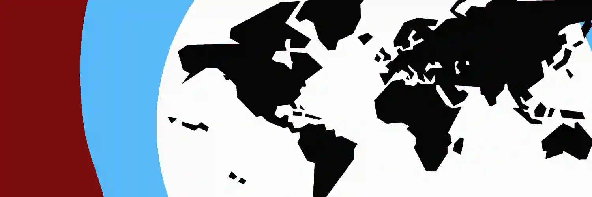

# 🗺️ BlackMaps™ - Sitio en desarrollo

## Descripción

Bienvenido al sitio web oficial de **BlackMaps**, una cuenta de X (antes Twitter) que se dedica a publicar mapas sobre absolutamente todo. ¿Algo existe? Le hacemos un mapa.

## Secciones

- **[Inicio](https://blackmaps.vercel.app/)**
- **[Historia](https://blackmaps.vercel.app/#about)**
- **[Mapas](https://blackmaps.vercel.app/maps)**

## Desarrollo

Este sitio web ha sido desarrollado por **[GenaDev](https://www.linkedin.com/in/genadev)** y alojado por **[GenaHost](https://genahost.vercel.app/)**. Los mapas y logos del sitio son propiedad de BlackMaps y no deben ser utilizados sin autorización.

- **[Repositorio](https://github.com/GenaAaaj/BlackMaps-Website/)**
- **[Licencia](https://github.com/GenaAaaj/BlackMaps-Website/blob/main/LICENSE)**
- **[GenaDev](https://www.linkedin.com/in/genadev)**

## Contacta a BlackMaps

- [Twitch](https://www.twitch.tv/mapsblack/)
- [Instagram](https://www.instagram.com/maps_black/)
- [Twitter](https://x.com/maps_black/)
- [GitHub](https://github.com/GenaAaaj/BlackMaps-Website/)
- [Correo Electrónico](mailto:maps.black8@gmail.com)

## Información Adicional

© 2024 **[BlackMaps™](https://blackmaps.vercel.app/)**. Sitio web desarrollado por **[GenaDev](https://www.linkedin.com/in/genadev)** y alojado por **[GenaHost](https://genahost.vercel.app/)**. Los mapas y logos del sitio son propiedad de BlackMaps y no deben ser utilizados sin autorización.

## Estructura del Proyecto

```plaintext
🌍 public/
    └── (imágenes y mapas)
🚧 src/
    ├── 🧩components/
    │     ├── Footer.jsx
    │     ├── Header.jsx
    │     ├── MapCard.jsx
    │     └── Logo.jsx
    ├── 📱pages/
    │     ├── maps/
    │     │   └── MapPage.jsx (map gallery)
    │     └───🏨Home.jsx (homepage)
    └── 🌱App.jsx (react-router)
